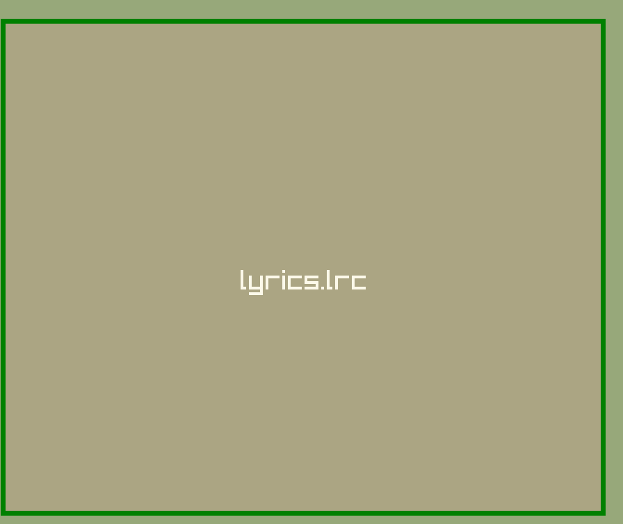

## What is `bool irLrc/bool isMp3` in menu.c?

### Here is the [Ref](../src/menu.c#L25)

- It is to check if the user sended the lrc or not
  - You may have seen when you upload a specfic file there is a green border

- to achive this we first check if ismp3/islrc true then we check inLrc/inMp3 true to achive this
