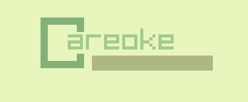

# Careoke

**Careoke Is an Open-Source Kareoke game made with Raylib-5.5 and some other libraries (check the Thanks To pages for more info)**

## Get Started

Before you begin, make sure you have the following:

- C compiler
- [`raylib`](https://github.com/raysan5/raylib) installed

### Building

#### Just run `make all` then grab the compiled output from `./out/game`

## Thanks to

[Raylib](https://github.com/raysan5/raylib) - For the base of this project

[libtinyfiledialogs](https://github.com/native-toolkit/libtinyfiledialogs) - For the File Dialogues

[Colorhunt](https://colorhunt.co/) - For the color Pallets

[j1gggs](https://www.youtube.com/channel/UCKx3WpttA9EjWHQ_iTBStuw) - For the background [music](https://www.youtube.com/watch?v=6pV-Qm0o6Rg)
